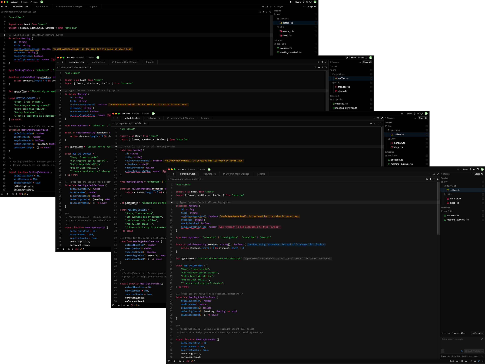
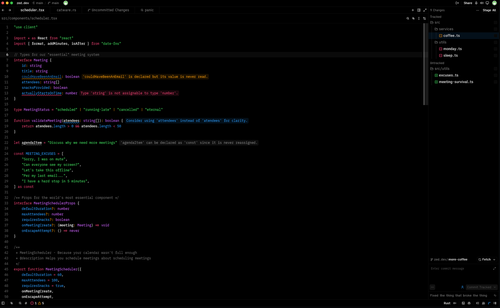
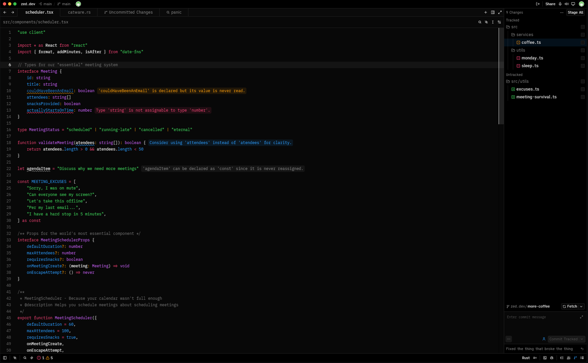
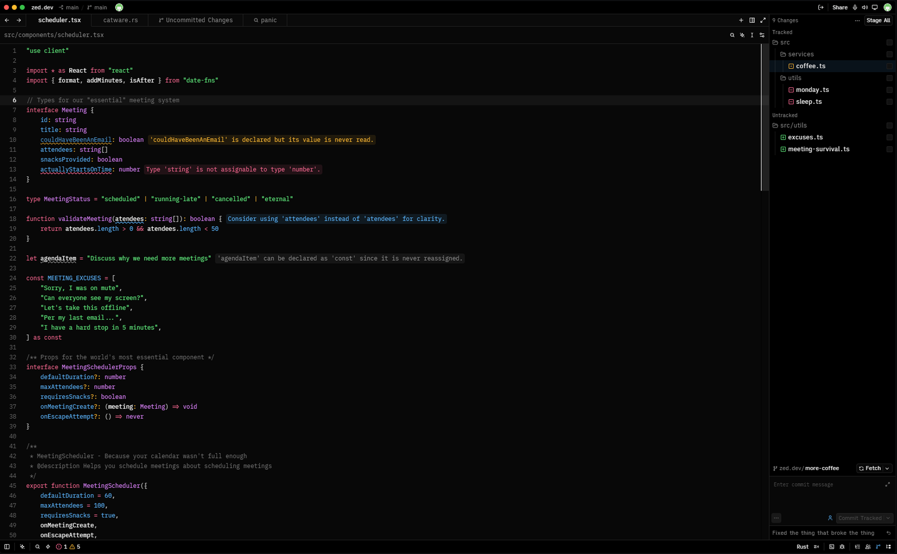
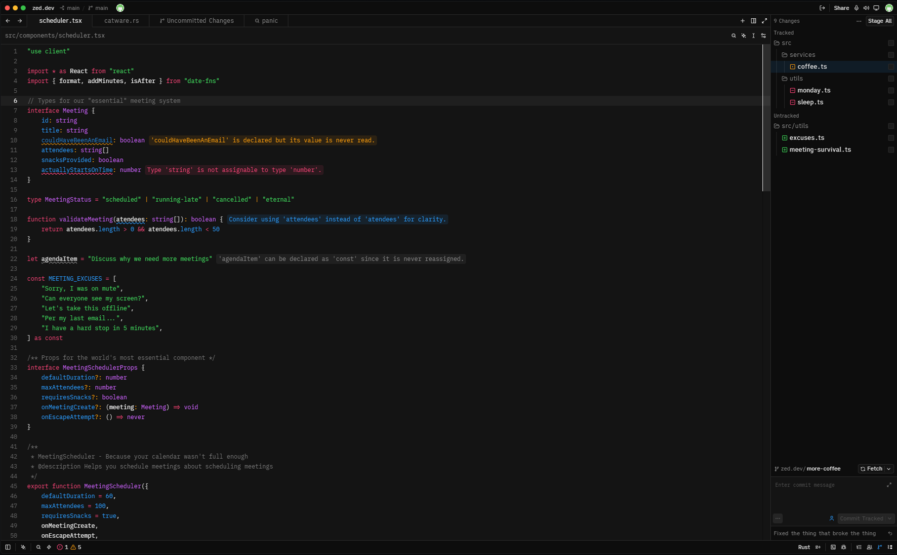

### Vivid Void (VIVO) Theme for Zed

A deep, void-like aesthetic featuring highly vivid syntax highlighting

	

## Previews

Vivid Void (VIVO) comes in four distinct variants:

<b>Singularity</b>

<b>Abyss</b>

<b>Flare</b>

<b>Horizon</b>

